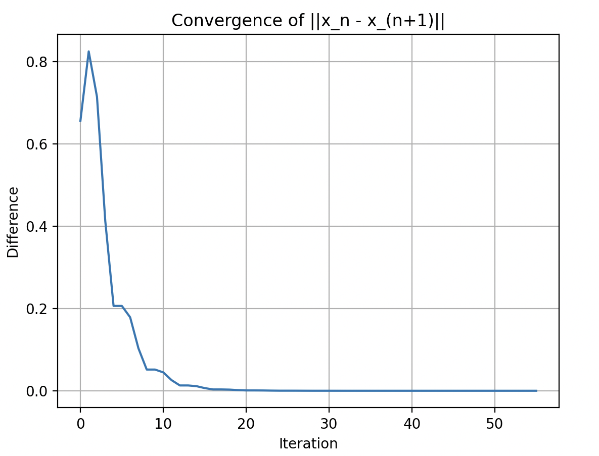

# 📘 PageRank: Graph Analysis and Visualization Tool

This project implements the **PageRank algorithm** from scratch using Python. It supports both synthetic and real-world graph inputs (via edge lists), visualizes the network, and computes steady-state distributions using power iteration and eigenvalue analysis.

---

## ⚙️ Tech Stack

- **Python 3**
- **NumPy** – linear algebra and probability vector math
- **Matplotlib** – convergence plotting and visualization
- **NetworkX** – graph construction and visualization
- **SciPy** – eigenvalue validation

---

## 🗂️ Project Structure
```

pagerank_project/
├── main.py            # Main script
├── real_edges.txt         # Real-world graph (edge list)
├── matrix.txt             # Optional custom matrix input
├── x0.txt                 # Optional starting vector
├── graph.png              # Sample graph output
├── convergence.png        # Convergence plot
└── README.md              # Project documentation

```

---

## 🔍 Features

- Parses real-world graphs from edge lists
- Builds transition matrices for PageRank computation
- Performs power iteration to find steady-state vectors
- Validates results via eigenvector comparison
- Visualizes graphs and convergence behavior

---

## 📊 Graph Visualization

Example graph constructed from `real_edges.txt`:


---

## 📈 Convergence Plot

Track how fast the power iteration converges:



---

## 📥 Getting Started

### 1. Install dependencies:

'''bash
pip install numpy matplotlib networkx scipy

### 2. Run the main script:
python main.py

### 3. Sample input (real_edges.txt):
```
A B
A C
B C
C A
D C
E C
F C
```


This input forms a directed graph where nodes point to others — a format commonly used in citation networks, link graphs, or social networks.

## 🧪 Mathematical Validation

The steady-state vector from power iteration is compared to the eigenvector corresponding to eigenvalue ≈ 1 from SciPy:

Eigenvalue (should be ~1): 1.0000000000000007

Power Iteration Result:
[0.4 0.2 0.4 0.  0.  0. ]

SciPy Eigenvector (normalized):
[0.16666667 0.16666667 0.16666667 0.16666667 0.16666667 0.16666667]

This shows how PageRank behaves on graphs with sinks and disconnected components — a perfect opportunity to extend with damping factors.

## 💡 Potential Enhancements
	•	Add damping factor to simulate random teleportation
	•	Turn it into a Flask web app or Jupyter dashboard
	•	Support CSV edge list input or graph export
	•	Compare PageRank with other centrality measures (degree, betweenness)

⸻

✍️ Author

Devin Curry


